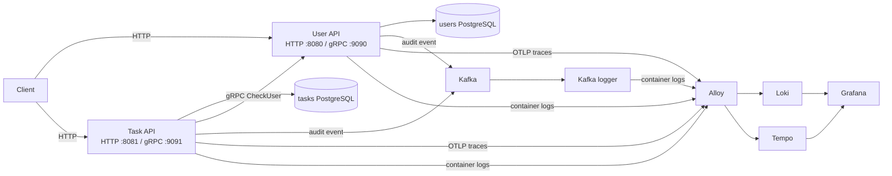
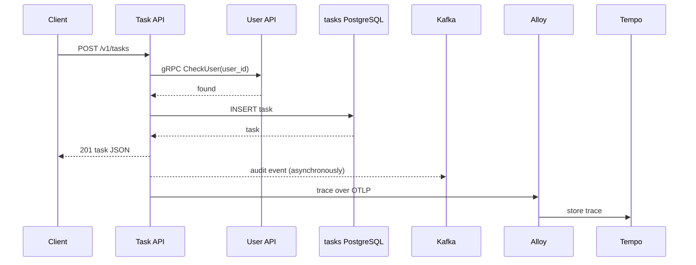

# Go services: HTTP, gRPC, Kafka, and OpenTelemetry

This is a small, practical system for learning how common backend tools fit together. It has two Go services:

- **User API** owns users, passwords, and sessions.
- **Task API** owns tasks. Before it creates or reassigns a task, it asks the User API whether the user exists.

The point is not that this is the only way to build a task app. It is a compact place to see the trade-off: separate services own separate data, so they need a network call to coordinate.

## Start the stack

You need Docker and Docker Compose.

```sh
docker compose up --build
```

When everything is running, use these entry points:

| Service | Address | What to learn from it |
| --- | --- | --- |
| User API | `http://localhost:8080` | HTTP and gRPC endpoints, PostgreSQL, Kafka publishing |
| Task API | `http://localhost:8081` | HTTP-to-gRPC service-to-service call, PostgreSQL, Kafka publishing |
| User gRPC | `localhost:9090` | `UserService`, including `CheckUser` |
| Task gRPC | `localhost:9091` | `TaskService` |
| Kafka | `localhost:19092` | Audit-event transport |
| Grafana | `http://localhost:3000` | Explore logs in Loki and traces in Tempo |
| Alloy | `http://localhost:12345` | Log collector and OpenTelemetry receiver status |

PostgreSQL is exposed on `localhost:15432` (`users`) and `localhost:25432` (`tasks`), with user/password `app` / `app`.

## The system at a glance



Read it in two lanes:

1. The **business lane** is Client → API → PostgreSQL. The Task API adds one synchronous gRPC call to the User API because its database cannot enforce a foreign key in the other database.
2. The **observation lane** is separate from the response. APIs write structured logs, publish audit events, and export traces; Grafana lets you inspect the resulting logs and traces.

## Follow one request end to end

Start with the most instructive request: create a task for an existing user.



What each step teaches:

| Step | Tool | Why it exists here |
| --- | --- | --- |
| `POST /v1/tasks` | HTTP + JSON | The client-facing, easy-to-call API. |
| `CheckUser` | gRPC + Protobuf | A typed, internal contract between services. It prevents tasks pointing at unknown users. |
| `INSERT task` | PostgreSQL | Each service owns its own data and migrations. |
| Audit event | Kafka | A copy of the request/result is sent to a topic after the HTTP response path; the logger can consume it independently. |
| Trace export | OpenTelemetry | Carries one trace ID across the HTTP request, gRPC call, database queries, and Kafka publish. |

The Task API has a five-second timeout around its gRPC call. That is important: a dependency that stalls should not make the caller wait forever.

## Where to read the code

Read in this order. Each layer is small and the same pattern appears in both services.

| Question | Files to open | What to look for |
| --- | --- | --- |
| How does a process start? | `user/main.go`, `task/main.go` | Wires database, Kafka, HTTP, gRPC, and tracing together. |
| What does an HTTP request do? | `user/api/http.go`, `task/api/http.go` | Routes, JSON decoding, request logging, audit middleware. |
| How do services communicate? | `task/main.go`, `user/api/grpc.go` | Task creates a User gRPC client; User implements `CheckUser`. |
| What is the shared contract? | `proto/user/v1/user.proto`, `proto/task/v1/task.proto` | Protobuf service and message definitions. |
| What is the business logic? | `user/service/user.go`, `task/service/task.go` | Validation, password/session handling, and the user-existence check. |
| Where are SQL and migrations? | `user/db/postgres.go`, `task/db/postgres.go` | Schema, repository implementations, and database spans. |
| How are audit records sent? | `user/audit/kafka.go`, `task/audit/kafka.go` | Kafka topic creation, JSON events, password/token redaction. |
| How are logs and traces collected? | `observability/alloy/config.alloy` | Docker log discovery → Loki, OTLP traces → Tempo. |

## HTTP APIs

All bodies are JSON and unknown fields are rejected.

### User API

| Method and path | Purpose |
| --- | --- |
| `POST /v1/users/sign-up` | Create a user. |
| `POST /v1/users/sign-in` | Return a session token. |
| `PATCH /v1/users/me` | Update the signed-in user; requires `Authorization: Bearer <token>`. |

```sh
curl -s http://localhost:8080/v1/users/sign-up \
  -H 'Content-Type: application/json' \
  -d '{"email":"ada@example.com","password":"password","username":"Ada"}'
```

```sh
curl -s http://localhost:8080/v1/users/sign-in \
  -H 'Content-Type: application/json' \
  -d '{"email":"ada@example.com","password":"password"}'
```

Passwords are bcrypt-hashed. Session tokens last 24 hours; only their SHA-256 hashes are stored.

### Task API

A task has `id`, `name`, `description`, and `user_id`.

| Method and path | Purpose |
| --- | --- |
| `POST /v1/tasks` | Create a task after checking the referenced user over gRPC. |
| `GET /v1/tasks/{id}` | Fetch one task. |
| `GET /v1/users/{user_id}/tasks` | List a user's tasks. |
| `PATCH /v1/tasks/{id}` | Update one or more task fields; changing `user_id` triggers `CheckUser` again. |

Replace `USER_UUID` with the `id` from sign-up:

```sh
curl -i http://localhost:8081/v1/tasks \
  -H 'Content-Type: application/json' \
  -d '{"name":"Write docs","description":"Explain the request flow","user_id":"USER_UUID"}'
```

Task names must be non-blank and at most 100 characters; descriptions are at most 1000 characters. User and task IDs must be UUIDs.

## Explore what happened

After making a request, run:

```sh
docker compose logs -f task-api user-api kafka-logger
```

Then open Grafana. In **Explore**:

- Select **Loki** and query `{service="task-api"}`. Add `| json | status >= 400` to show failed requests.
- Select **Tempo** and search `service.name = task-api`. Open a trace from a task creation to see the HTTP, gRPC, SQL, and Kafka spans together.

This relationship is intentional: logs answer “what was printed?”; traces answer “which components handled this one request?” Kafka audit messages answer “what request/result event was published?”

## Protobuf and gRPC

The `.proto` files are the source of truth. Generated Go code lives beside them in `proto/` and is shared by both APIs.

```sh
./scripts/gen-proto.sh
```

The script runs a pinned Buf Docker image, so you do not need to install `protoc` or code-generation plugins locally. Regenerate only after editing a `.proto` file.

## Run and test without the full stack

Start the databases, Kafka, and observability dependencies, then run an API from its module:

```sh
docker compose up -d kafka user-postgres task-postgres alloy loki tempo grafana
cd user && go run .
# in another terminal
cd task && go run .
```

Outside Compose, the defaults are `localhost:15432` for users, `localhost:25432` for tasks, `localhost:19092` for Kafka, and `localhost:9090` for the User gRPC service. Override them with `DATABASE_URL`, `KAFKA_BROKERS`, `KAFKA_TOPIC`, `USER_GRPC_ADDR`, and `OTEL_EXPORTER_OTLP_ENDPOINT`.

Run the checks:

```sh
(cd user && go test ./...)
(cd task && go test ./...)
(cd kafka-logger && go test ./...)
```

## Suggested learning experiments

1. Create a user, then create a task. In Tempo, identify the `CheckUser` span and its parent HTTP span.
2. Try a made-up `user_id`. Notice that Task returns `404` because User's gRPC response says the user does not exist.
3. Search `{service="kafka-logger"}` in Loki. Compare the Kafka audit record with the original HTTP request.
4. Stop `user-api`, then create a task. Observe why synchronous service dependencies need timeouts and error handling.

## Repository layout

```text
user/            User service: HTTP, gRPC, service logic, PostgreSQL, Kafka audit
task/            Task service: same layers plus the User gRPC client
proto/           Protobuf contracts and generated Go bindings
kafka-logger/    Simple Kafka consumer that prints audit events
observability/   Alloy, Loki, Tempo, and Grafana configuration
compose.yaml     The runnable local system
```
